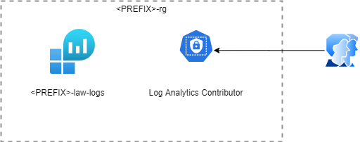

# infrastructure.azure.core.diagnostics

The `infrastructure.azure.core` repository stores the resource configuration files for
[Terraform](https://www.terraform.io/) to deploy a
[resource group](https://docs.microsoft.com/en-us/azure/azure-resource-manager/management/overview#terminology)
with [Azure log analytics](https://docs.microsoft.com/en-us/azure/azure-monitor/platform/data-platform-logs)
to an Azure subscription so that the logs for the different Azure resources in an environment are
collected in one location allowing them to be analyzed and forwarded.

The Terraform configuration creates the following group of resources:

* One resource group to contain all the resources
* The [log analytics workspace](https://docs.microsoft.com/en-us/azure/azure-monitor/log-query/log-query-overview)
* A [security center workspace](https://docs.microsoft.com/en-us/azure/security-center/security-center-enable-data-collection)
* A [log analytics solution](https://docs.microsoft.com/en-us/azure/azure-monitor/insights/solutions?tabs=portal)
* A role assignment allowing users to contribute to log analytics

All resources are named after the type of resource they are, e.g. `-rg` for the resource group, prefixed with a standard prefix. The prefix consists of
a combination of the Environment, e.g. Production, the Azure location,
e.g. Australia East, and a category, in this case `analytics`:

    ${var.environment_short}-${var.location_short}-tf-${var.category}

The default values for each of the variables are defined in the `variables.tf` file

* `environment_short` = `p` - For production
* `location_short` = `aue` - For the Australia East region
* `category` = `analytics`

Which leads to a prefix of: `p-aue-tf-analytics`

By default no tags are added to any of the resources. Tags can be added by
setting the `tags` variable as defined in the `variables.tf` file.

## Variables

* **sku** - Specified the Sku of the Log Analytics Workspace.
* **retention_in_days** - The workspace data retention in days. Possible values range between 30 and 730.
* **security_center_subscription** - List of subscriptions this log analytics should collect data for. Does not work on free subscription.
* **solutions** - A list of solutions to add to the workspace. Should contain solution_name, publisher and product.
* **contributors** - "A list of users / apps that should have Log Analytics Contributer access. Required to use log analytics as log source.
* **category** - The name of the category that all the resources are running in.
* **environment** - The name of the environment that all the resources are running in.
* **environment_short** - The short name of the environment that all the resources are running in.
* **location** - The Azure region in which the resources should be created.
* **location_short** - The short name of the Azure region in which the resources should be created.
* **tags** - Tags to apply to all resources created.

## Use

In order to run the Terraform configuration in this repository you need to have an Azure subscription and be [connected to that subscription](https://www.terraform.io/docs/providers/azurerm/index.html).

Once you are signed in run the Terraform [plan](https://www.terraform.io/docs/commands/plan.html) command to preview the changes that will be made.

    tf plan -out ./build/tf/plan

When you are happy with the plan execute the plan with the Terraform [apply](https://www.terraform.io/docs/commands/apply.html) command.

    tf apply ./build/tf/plan
